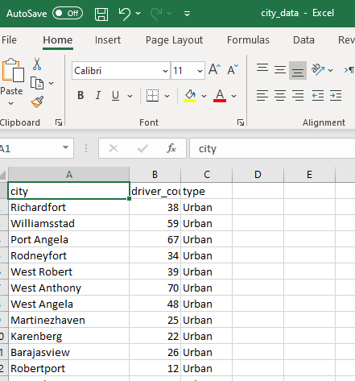
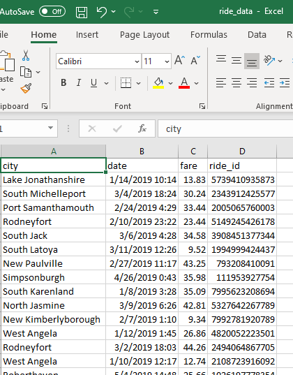
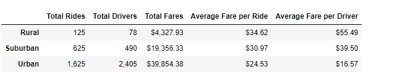
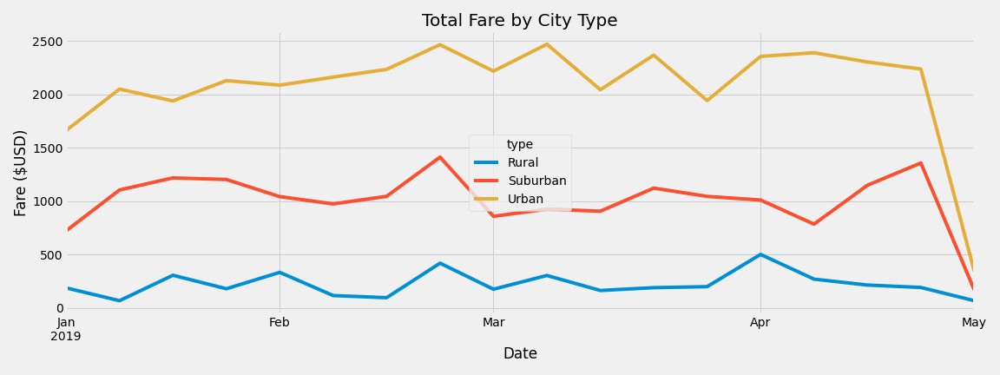

# PyBer Ride-Sharing Data Analysis

## Project Overview
PyBer is a company which owns a Python based app for ride sharing. The objective of the analysis is to analyse ride sharing app data from 2019 to acheive two business goals.
- Improve access to ride sharing serives
- Determine affordability for under-served neighboorhoods

The analysis includes :
- Analyze different metrics by city type e.g Volume (Rides,drivers, fare,and averge fare by driver and ride)
- Analyze of how total weekly revenue (fare) varies by city type during the first four months of 2019.

## Resources
- Data source: 
    - City level ride Data "city_data.csv" [Link to city raw data](Resources/city_data.csv)
    - Ride Data "ride_data.csv" [Link to ride raw data](Resources/ride_data.csv)
    
- Software: Anaconda Jupyter notebook Python 3.7 and panda
- Link to the Jupyter notebook which performs analysis for challenge is : [PyCBer_Challenge.ipynb](PyBer_Challenge.ipynb)
- Data sources format : see the below screenshot to see the expected file format for data source.

#### City Data format:
  
#### Ride Data format:
  

## Analysis Results
 
#### 1. PyBer Ride share summary by ciry type:

- WHile Urban communities has the higest percentage of ride counts and brings the highest percent of revenue , they have the lowest fare per ride and per driver. 
- Rural communities have the lowest contribbution for ride counts and driver counts, but they average fare per driver and per ride was the highest among all city types.

#### 2. PyBer total fare by week by city type:

- Urban and Suburban weekly total revenue (fare) follows the same trend. Though Urban communities have almost double the urban total fare. 
- Rural communities contribute to approximately 7% revenue.

l
## Summary

- Based on the analysis , Rural and Urban communiites are under served . However this may not be true if the actual demand is also in low in these communities. So before deciding to increase the serivce in these under served community, PyBer should evaluae the demand and market share . And increase number of drverrs in these communities.
- The number of drivers in Urban communities are quite high and percent of rides per driver is 68%. So in order to increase the ride per driver ratio, company should invest on analyzing the data too find the main causes of this behavior. e.g is this due to the fact the demand is low and we've more drivers. or is it becuase we are loosing the market share due to drivers are not in the right area.
- In order to improve the affordability for rural and urban communities, company should evalaute the option of either increasing the ride rate in urban communities and reduce it for Rural and suburban based on better mileage. 

All of the above recomendation require some market reasearch and furhter data analysis to confirm the assumptions in making these recomendations.
